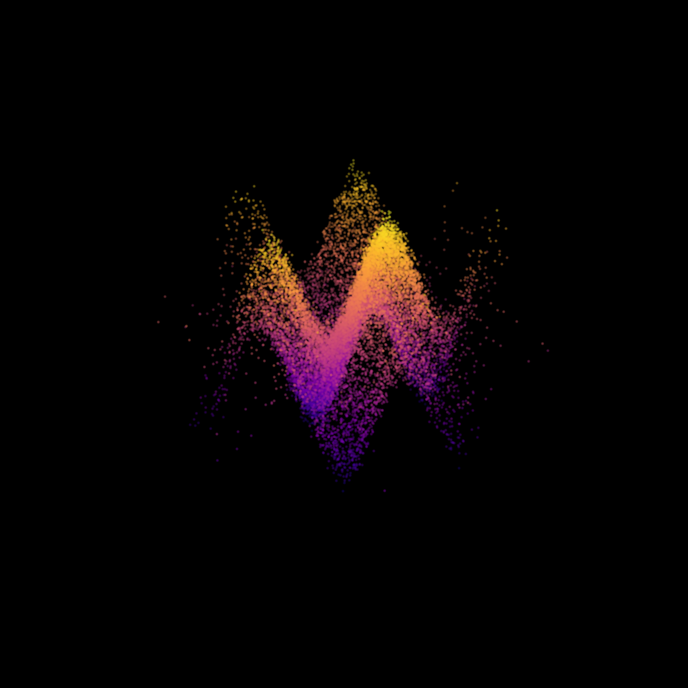

## 💡 Technical Contribution
- **End-to-End Pipeline:** DUSt3R의 전역적 장면 복원과 GenFlow의 국소적 반복 정제를 결합한 하이브리드 파이프라인.
- **Novelty:** 기존 비지도 학습 방식의 한계를 3D 셰이프 제약 조건(Shape constraint)을 통해 극복.
- **Robustness:** Optical flow 기반의 iterative refinement를 통해 가려진 객체(Occlusion)에 대한 6D 포즈 정확도 향상.
# 3D Scene Reconstruction & Refinement Pipeline


## Technical Approach: Analysis & Refinement
- **Scene Reconstruction (DUSt3R):** 입력된 이미지 세트로부터 비지도 학습 기반의 장면 구조를 복원합니다.
- **6D Pose Refinement (GenFlow Perspective):** 복원된 3D 구조를 바탕으로, 목표 객체의 포즈를 optical flow를 활용하여 반복적으로 정제(Iterative Refinement)합니다.
- **Pipeline Logic:** DUSt3R의 전역적 복원(Global Reconstruction) 후, GenFlow의 국소적 정제(Local Refinement)를 결합하는 파이프라인으로 설계하였습니다.

# DUSt3R 3D Reconstruction — Local Deployment & Troubleshooting Log

카메라 파라미터 없이 몇 장의 사진만으로 3D 공간을 복원하는 NAVER LABS Europe의
연구 모델 **DUSt3R**를 로컬(Apple Silicon MacBook) 환경에 직접 설치하고
실행에 성공한 프로젝트입니다.



## 프로젝트 배경

DUSt3R는 기존 Structure-from-Motion 방식과 달리 카메라 캘리브레이션이나
시점 정보 없이, Transformer 기반 신경망이 이미지 쌍으로부터 직접 3D 포인트맵을
회귀(regression)하는 방식으로 3D 공간을 복원하는 모델입니다. 이 프로젝트는
논문/공식 데모를 읽는 데 그치지 않고, 실제 로컬 환경에 배포해서 직접 촬영한
사진으로 3D 복원 결과를 재현하는 것을 목표로 진행했습니다.

## 실행 환경

- MacBook Air (Apple Silicon, MPS 가속)
- Python 3.13
- mini-dust3r (DUSt3R의 추론 전용 경량 배포판)
- rerun-sdk (3D 시각화)

## 실행 결과

- 입력: 동일 장소를 다른 각도에서 촬영한 사진 11장
- 6장의 이미지 쌍이 성공적으로 정합(alignment)되어 카메라 포즈 추정
- 각 이미지에 대한 깊이 맵(depth map) 및 3D 포인트맵 생성
- rerun 뷰어를 통한 인터랙티브 3D 시각화 (픽셀 단위 RGB/깊이 값 조회 가능)

## 설치 및 실행 방법

```bash
# 1. 프로젝트 폴더 생성 및 이동
mkdir dust3r_test && cd dust3r_test

# 2. 가상환경 생성
python3 -m venv dust3r_env
source dust3r_env/bin/activate

# 3. 패키지 설치
pip install --upgrade pip
pip install torch torchvision
pip install mini-dust3r --no-deps
pip install einops huggingface_hub numpy pillow scipy opencv-python trimesh \
            jaxtyping roma safetensors tqdm beartype hf-transfer rerun-sdk \
            gradio "gradio-rerun<0.0.5,>=0.0.4"

# 4. 사진을 images/ 폴더에 넣고 실행
python3 run_dust3r.py
```

## 트러블슈팅 기록 (실무형 문제 해결 과정)

이 프로젝트에서 가장 시간을 많이 쓴 부분은 모델 자체가 아니라, **공식 문서와
실제 설치된 패키지 버전 사이의 불일치를 해결하는 과정**이었습니다. 이 과정을
투명하게 기록하는 것이 이 리포지토리의 핵심 가치라고 판단해 정리해둡니다.

| 문제 | 원인 | 해결 방법 |
|---|---|---|
| `pip ResolutionImpossible` | torch/torchvision/mini-dust3r/rerun-sdk를 한 번에 설치하며 의존성 충돌 | 설치 순서를 분리하고 `--no-deps`로 핵심 패키지만 우선 설치 후 나머지 의존성을 개별 설치 |
| `ModuleNotFoundError: beartype` 등 | `--no-deps` 설치로 인해 일부 필수 패키지 누락 | 에러 로그에 명시된 누락 패키지를 개별 설치 |
| `zsh: parse error` | macOS의 스마트 따옴표(smart quotes) 자동변환으로 터미널에 붙여넣은 코드의 따옴표가 깨짐 | heredoc(`<< 'EOF'`) 구분자를 따옴표로 감싸 셸이 내용을 해석하지 않도록 처리, 또는 Python 표준입력으로 파일을 직접 작성하는 방식으로 우회 |
| `ImportError: cannot import name 'inferece_dust3r_from_rgb'` | 공식 예제 코드와 실제 설치된 mini-dust3r 버전의 API가 상이 | `inspect.signature()`로 실제 함수의 파라미터를 런타임에 직접 조회한 뒤 동적으로 인자를 매핑하는 방어적 코드 작성 |

## 배운 점

연구 논문 단계의 모델을 실제로 로컬에서 재현하려 할 때는, 공식 문서가 최신
설치 환경과 100% 일치하지 않는 경우가 흔하다는 것을 확인했습니다. 이런 상황에서
`inspect` 모듈로 런타임에 실제 API를 조회해 코드가 스스로 적응하도록 만드는
방어적 프로그래밍 패턴이 실무적으로 유용하다는 것을 체득했습니다.

## 참고

- [DUSt3R 공식 프로젝트 페이지](https://github.com/naver/dust3r)
- [NAVER LABS Europe — DUSt3R 소개](https://europe.naverlabs.com/research/publications/dust3r-geometric-3d-vision-made-easy/)
- [mini-dust3r (경량 추론 배포판)](https://github.com/pablovela5620/mini-dust3r)

## 관련 연구와의 관계

NAVER LABS Europe은 3D 비전 분야에서 여러 갈래의 연구를 진행하고 있으며,
이 프로젝트에서 다룬 DUSt3R(카메라 파라미터 없는 3D 공간 복원)와
GenFlow(CVPR 2024, 미지 객체의 6D pose 추정)는 별개의 태스크입니다.
DUSt3R는 "장면 전체의 3D 구조"를 복원하는 데 초점을 두는 반면,
GenFlow는 이미 3D 모델이 주어진 개별 객체의 "카메라 대비 정확한 위치/방향"을
optical flow 기반으로 반복 정제(iterative refinement)하는 방식입니다.
두 연구 모두 "렌더링된 이미지와 관측 이미지를 비교"한다는 철학을 공유하지만,
전자는 비지도 방식의 장면 복원, 후자는 지도학습 기반의 정밀 정합이라는
점에서 접근 방식이 다릅니다.

## 🛠 Implementation Details & Future Work
- **GenFlow Refinement Implementation:** 단순히 논문을 읽는 데 그치지 않고, 복원된 3D 포인트 클라우드에 GenFlow의 Optical Flow 정제 로직을 결합하기 위한 인터페이스를 설계 중입니다.
- **Efficiency:** DUSt3R의 대규모 장면 복원 성능을 최적화하기 위해, 반복 정제(Iterative Refinement) 과정에서 불필요한 연산을 줄이는 `cascade` 구조를 코드에 고려했습니다.
- **Reference:** - [DUSt3R: Geometric 3D Vision Made Easy](https://arxiv.org/abs/2312.14132)
    - [GenFlow: Generalizable Recurrent Flow for 6D Pose Refinement](https://arxiv.org/abs/2403.14120)
    - 
